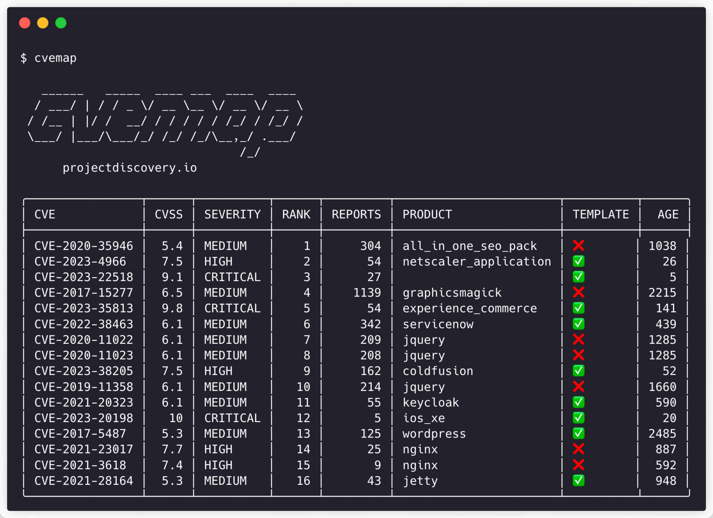

<h1 align="center">CVEMap</h1>

<p align="center">
<a href="https://opensource.org/licenses/MIT"></a>
<a href="https://goreportcard.com/badge/github.com/projectdiscovery/cvemap"></a>
<a href="https://pkg.go.dev/github.com/projectdiscovery/cvemap/pkg/cvemap"></a>
<a href="https://github.com/projectdiscovery/cvemap/releases"></a>
<a href="https://twitter.com/pdiscoveryio"></a>
<a href="https://discord.gg/projectdiscovery"></a>
</p>
<p align="center">
  <a href="#features">Features</a> •
  <a href="#installation">Installation</a> •
  <a href="#usage">Usage</a> •
  <a href="#examples">Example</a> •
  <a href="https://discord.gg/projectdiscovery">Join Discord</a>
</p>

Navigate the Common Vulnerabilities and Exposures (CVE) jungle with ease using CVEMAP, a command-line interface (CLI) tool designed to provide a structured and easily navigable interface to various vulnerability databases.

   
# Features



 - **CVE Dataset Search & Query**
 - **CVE to EPSS Mapping**
 - **CVE to KEV Mapping**
 - **CVE to CPE Mapping**
 - **CVE to GitHub POCs Mapping**
 - **CVE to Nuclei Template Mapping**
 - **CVE to HackerOne report Mapping**
 - Customizable Filters on CVE data
 - STDIN Input / JSONL Output


## Installation

cvemap requires **Go 1.21** to install successfully. To install, just run the below command or download pre-compiled binary from [release page](https://github.com/projectdiscovery/cvemap/releases).

```console
go install github.com/projectdiscovery/cvemap/cmd/cvemap@latest
```

## Usage
```console
cvemap -h
```
This will display help for the tool. Here are all the switches it supports.

```console
Usage:
  cvemap [flags]

Flags:
CONFIG:
   -auth  configure projectdiscovery cloud (pdcp) api key (default true)

OPTIONS:
   -id string[]                    cve to list for given id
   -cwe, -cwe-id string[]          cve to list for given cwe id
   -v, -vendor string[]            cve to list for given vendor
   -p, -product string[]           cve to list for given product
   -eproduct string[]              cves to exclude based on products
   -s, -severity string[]          cve to list for given severity
   -cs, -cvss-score string[]       cve to list for given cvss score
   -c, -cpe string                 cve to list for given cpe
   -es, -epss-score string         cve to list for given epss score
   -ep, -epss-percentile string[]  cve to list for given epss percentile
   -age string                     cve to list published by given age in days
   -a, -assignee string[]          cve to list for given publisher assignee
   -vs, -vstatus value             cve to list for given vulnerability status in cli output. supported: new, confirmed, unconfirmed, modified, rejected, unknown

UPDATE:
   -up, -update                 update cvemap to latest version
   -duc, -disable-update-check  disable automatic cvemap update check

FILTER:
   -q, -search string  search in cve data
   -k, -kev            display cves marked as exploitable vulnerabilities by cisa (default true)
   -t, -template       display cves that has public nuclei templates (default true)
   -poc                display cves that has public published poc (default true)
   -h1, -hackerone     display cves reported on hackerone (default true)
   -re, -remote        display remotely exploitable cves (AV:N & PR:N | PR:L) (default true)

OUTPUT:
   -f, -field value         fields to display in cli output. supported: product, vendor, assignee, age, poc, cwe, epss, vstatus, kev, template
   -fe, -exclude value      fields to exclude from cli output. supported: product, vendor, assignee, age, poc, cwe, epss, vstatus, kev, template
   -lsi, -list-id           list only the cve ids in the output
   -l, -limit int           limit the number of results to display (default 50)
   -offset int              offset the results to display
   -j, -json                return output in json format
   -epk, -enable-page-keys  enable page keys to navigate results

DEBUG:
   -version            Version
   -silent             Silent
   -verbose            Verbose
   -debug              Debug
   -hc, -health-check  run diagnostic check up
```

## Configuring CVEMap CLI

CVEMap CLI is built on top of the CVEMap API that requires API Token from [ProjectDiscovery Cloud Platform](https://cloud.projectdiscovery.io/?ref=api_key) that can be configured using environment variable named `PDCP_API_KEY` or using interactive `-auth` option as shown below.

### Using environment variable

```console
export PDCP_API_KEY=*************
```

### Using auth option

```console
cvemap -auth


   ______   _____  ____ ___  ____  ____
  / ___/ | / / _ \/ __ \__ \/ __ \/ __ \
 / /__ | |/ /  __/ / / / / / /_/ / /_/ /
 \___/ |___/\___/_/ /_/ /_/\__,_/ .___/ 
                               /_/
            

    projectdiscovery.io

[INF] Get your free api key by signing up at https://cloud.projectdiscovery.io
[*] Enter PDCP API Key (exit to abort): *************
[INF] Successfully logged in as (@user)
```

## Running CVEMap

For details about running cvemap, see https://docs.projectdiscovery.io/tools/cvemap/running.


## Note

- CVE dataset gets updated in every 6 hours.

## References

- **[National Vulnerability Database (NVD)](https://nvd.nist.gov/developers)**: Comprehensive CVE vulnerability data.
- **[Known Exploited Vulnerabilities Catalog (KEV)](https://www.cisa.gov/known-exploited-vulnerabilities-catalog)**: Exploited vulnerabilities catalog.
- **[Exploit Prediction Scoring System (EPSS)](https://www.first.org/epss/data_stats)**: Exploit prediction scores.
- **[HackerOne](https://hackerone.com/hacktivity/cve_discovery)**: CVE discoveries disclosure.
- **[Nuclei Templates](https://github.com/projectdiscovery/nuclei-templates)**: Vulnerability validation templates.
- **[Trickest CVE](https://github.com/trickest/cve) / [PoC-in-GitHub](https://github.com/nomi-sec/PoC-in-GitHub/)** GitHub Repository: Vulnerability PoCs references.
--------

<div align="center">

**cvemap** is made with ❤️ by the [projectdiscovery](https://projectdiscovery.io) team and distributed under [MIT License](LICENSE).

   
<a href="https://discord.gg/projectdiscovery"></a>